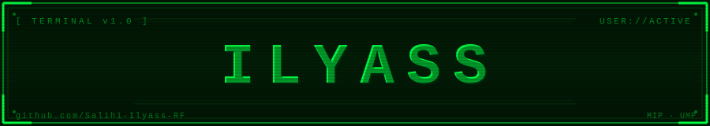

<!-- Header -->
<div align="center">


# `> Ilyass Salihi` &nbsp;[](https://git.io/typing-svg)


</div>

---

## `$ whoami`

```bash
name       : Ilyass Salihi
alias      : Salihi-Ilyass-RF
program    : MIP — Mathematics, Computer Science, Physics
university : Mohammed Premier University — Oujda, Morocco 🇲🇦
status     : Student · Builder · Explorer
bio        : "I do my best :)"
```

---

## `$ cat skills.txt`

### 🌐 Web Development


### 💻 Programming Languages


### 🖥️ Systems & Hardware


---

## `$ git stats`

<div align="center">

&nbsp;&nbsp;

</div>

---

## `$ cat /etc/contact.conf`

<div align="center">

| Platform | Handle |
|----------|--------|
| 🐙 **GitHub** | [Salihi-Ilyass-RF](https://github.com/Salihi-Ilyass-RF) |
| 💼 **LinkedIn** | [ilyass-salihi](https://www.linkedin.com/in/ilyass-salihi-307193352/) |
| 📧 **Email** | [ilyasssalihi192@gmail.com](mailto:ilyasssalihi192@gmail.com) |
| 💬 **Discord** | `PooTiiCaaTee#7543` |
| 📸 **Instagram** | [@sali_ilyass_rf](https://www.instagram.com/sali_ilyass_rf) |
| 📘 **Facebook** | [ilyass.salihi.2025](https://www.facebook.com/ilyass.salihi.2025) |

</div>

---

<div align="center">

```
[PROCESS COMPLETE] — profile loaded for Salihi-Ilyass-RF
● ONLINE  ▲ OPEN TO COLLAB  © 2024
```

</div>
